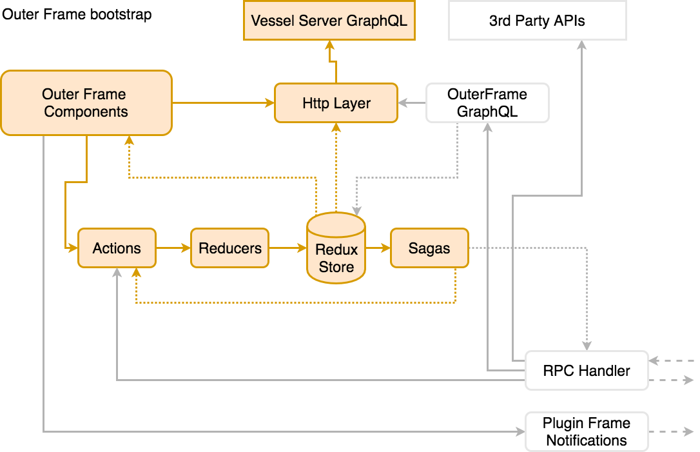
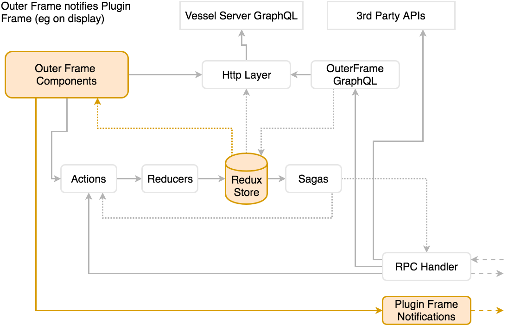
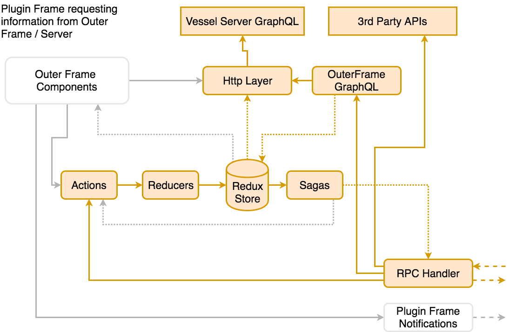

This section discusses the application and Outer Frame loading process.

## Loading and bootstrapping the application

The application, and specifically the Outer Frame, is served by the Invest Server (a HTTP web server). The Invest Server is configured to serve the outer frame application from the root (http://server/) context.

On load, the Outer Frame application has no data itself. Therefore its initial task is to download some configuration information from the server via the API. This initial request includes settings, a list of plugins, etc. The application settings provide branding information (e.g. the application name to display). 

All access is performed by the GraphQL endpoint on the server. Each component in the application makes GraphQL requests the for information they need (or indeed for information they believe that other plugins, etc will need).

GraphQL requests are made using the React Apollo GraphQL framework. When the response is returned, the data is pushed into the Redux store via a Redux action. We adopt this approach so that certain information always available, without needing to make repeated requests to the server. As each GraphQL request is a HTTP request, there is HTTP middleware (link in Apollo) which is used to add session information (for authentication purposes).

When the data responses are returned, the application can be displayed. The application renders a list of available plugins and authentication options. If the URL states that a plugin should be displayed the application will load and display that plugin. This allows the use of bookmarks or shared links to specific application pages.

## Hosting the plugins

When the user clicks on a plugin (either from the outer frame or by clicking a link in another plugins), the URL is updated to reflect which plugin is in view. 

The outer frame opens each plugin within its own `iframe`, where the `src` attribute is set to the plugins HTML link (on the Invest Server). These `iframe`s are not reused between plugins to avoid any accidental disclosure of information between plugins. Each `iframe` is run in sandbox mode, and this is quite restrictive on the operations the `iframe` can perform:

* treat the content as being from a unique origin (this means that the plugin can't access the outer frame and can't access the server)
* disable browser APIs
* prevent potentially malicious content 
* prevent the content to navigate its top-level browsing context
* block automatically triggered features (such as automatically playing a video or automatically focusing a form control)

In fact only the following is permitted:

* Allow Javascript execution as this is fundamental to most plugins.
* Allow form submission in order to allow the plugin developer to present forms to the user.
* Displaying alert notification, as although these is not a user friendly way to display information or a warning, it is simple for the developer and is a sensible way of telling the user that the operation they are about to perform may have dangerous side effects.

## Communication between the Outer Frame and a plugin

Once the `iframe` has loaded, the Outer Frame creates a two-way connection between it and the plugin frame. 

Once the communication layer is established, the Outer Frame sends a series of messages to the plugin frame. These include a 'loaded' message, a 'shown' message and then if an intent has been provided it is sent to the plugin as an 'action' message.

## Responding to the plugin requests

As noted in previous sections the plugin can make requests of the Outer Frame. This is necessary to the function of the plugins - due to the sandboxing of the plugin it can not make requests to the server itself.

When a plugins wishes to make an API request to the server, it is actioned by a Handler. The handler is responsible for the execution of requests and the return of a response. The handler sits inside the Outer Frame.

There are three ways the handler may action a request:

* If the request is a GraphQL operation then it is passed to the Outer Frame's GraphQL service. This service is, in effect, a proxy to the Invest Server's GraphQL endpoint, but which is enhanced with a number of additional operations which the Outer Frame can action directly. For example, getting a list of plugins. Having a local GraphQL service does add complexity but it reduces the need for a server round trip and it allows for specialised, state aware responses. For example, the Outer Frame will only list the UI Plugins for which the user has access.
* We provide a `fetch` operation as part of the plugin API. This replaces the native `fetch` which is available in the browser. The reason for this replacement is due to the effect of sandboxing and also because we wish to add authentication information to each HTTP request (when it is directed to the Invest Server).
* Some requests are wholly for the Outer Frame, for example navigation. Within the Outer Frame we map requests to Redux Actions. For each request, an actions is dispatched to the Redux store, which is  picked up by a Redux Saga to be actioned. The Saga has full access to the application state.

## Navigating away from a plugin

When the user navigates away from the displayed plugin the `iframe` showing that plugin is hidden and a new iframe is created (or old version made visible) for the new plugin. At the same time a message is sent to the old plugin notifying it that it is to be hidden. In this manner the plugin can stop any animations, data requests, processing, etc which might affect performance of whatever is in view. 

The nice side effect of the hidden iframe model is that the exact state of plugin is retained, and thus restored when the users navigates back to it.