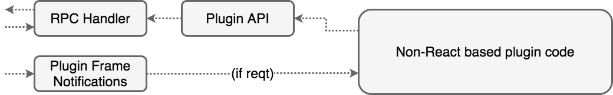

Although an Invest plugin can be a completely standalone web application, it is likely that most plugins will integrate some of the functionality on offer from the Invest Server or Outer Frame. In order to communicate with these the plugin uses the Invest connection layer.

There are two ways in which a Plugin can interact with the Outer Frame, and hence the Invest Server.

* Receive push notification of lifecycle elements which are send by the Outer Frame
* Use the Plugin API to make requests of the Outer Frame (and from there the Invest Server).

In the latter case this breaks down into distinct types of requests:

* Request GraphQL query or mutations
* Request the Outer Frame performs an operation

## Lifecycle notifications

The lifecycle notifications are one way messages sent from the Outer Frame to the Plugin Frame to inform the Plugin about its current state within the application or ask the Plugin to change its state.

The following notifications are sent (defined in the `Plugin Lifecycle` interface):

* onLoad: A view of this plugin has been created. It will not be visible yet. A plugin could use this to start requesting data from the server. Most basic plugins do this as soon as possible (not waiting for onLoad)
* onShow: The view of the plugin is being displayed to the user. The plugin should consider itself active.
* onHide: The view of the plugin has been hidden from the user (typically the user is just looking at another plugin). The plugin should stop any complex work that may not be needed - eg animations, calculations, etc. Use the onShow to resume these.
* onUnload: the view of the plugin is about to be removed, typically it's iframe will be discarded.. All the data associated with this instance will be lost. There is nothing the plugin can do to stop this, but it could save the data.
* onAction: The plugin is being called with an intent (action and payload). The plugin should review this and act appropriately. It's safe to assume you should respond immediately (eg the plugin is either shown or about to receive onShow).

## API

The API is (see InvestPluginApi), each returns a promise:

* `fetch`: A specialised `fetch` which replicates the global fetch function of browser, but which deals with addition of authentication information and the sandbox-ing of iframes. Developers should use this instead of global fetch (when talking to the Invest Server)
* `query(options, variables)` and `mutate(options, variables)` replicate the Apollo query and mutate functions. This can be useful for ad hoc queries, if you aren't using the React Apollo `graphql` function.
* `navigate(pluginId, action, payload)` request the outer frame navigate to the supplied pluginId, and  provide it athe action and payload (optional)
* `findPlugins(action)` return a list of Plugins which implement the required action. This is really a shortcut for a Graphql query.

The underlining communication mechanism is discuss in [later](ui.system-comms.html).

## Using Invest plugin React support

The core elements of Invest are written in React, and if you also want to use React in your plugins then the `InvestUiPlugin` component simplifies development.

`InvestUiPlugin` provides four functions:

* It sets up the InvestPluginApi using the RPC connection and Apollo, placing the plugin api into the context (as `pluginApi`)
* It sets up React Apollo, connecting it to the RPC connection.
* It handles some minor CSS around full size (100% width and height) vs non-fullscreen ( padded) plugins. use the 'fullscreen' support for maps and use the non-fullscreen support for tables, documents, etc.
* It routes actions from the handler to props on the child component.


Whilst the others 'just happen', the last one require some implementation from the developer. We envisage the InvestUiPlugin component to be used in the React render as follows:

```typescript
ReactDOM.render(
 <InvestUiPlugin fullscreen={false}>
   <App />
 </InvestUiPlugin>,
 document.getElementById('root') as HTMLElement
)
```

`App` is the root of the plugin's custom components. Note there is only a single component supported as a child of `InvestUiPlugin`. When plugin receives an `onAction(action,payload)` lifecycle event this is passed directly as props (action and payload) to the `App`. Thus the `App` can respond to an action in the way it would any other prop:


```typescript
 componentWillReceiveProps(nextProps: Props) {
   // Process action / payload if its changed
   if (this.props.action !== nextProps.action || !isEqual(this.props.payload, nextProps.payload)) {
  
     // If we support the action deal with it
     if(this.props.action === 'dataset.view') {
       // Payload is any, but we know it must be a view payload now
       // (TODO you'd need to verify this more closely perhaps)
       const payload = nextProps.payload as ViewPayload
       this.setState({
           datasetId: payload ? payload.datasetId : undefined,
       })
     }
   }
 }
```

Note in the above we retain a value from the payload in state. We find this a typical pattern - the state can then be used to decide what should happen in the `render()` function.

## Without React, but in a bundle / packaged app

If you are not using React in your plugin (or don't wish to use the InvestUiPlugin component), then the utility React components are not necessary. Instead you can either use the various invest libraries as dependencies in your own project (as `invest-plugin`).

This advice is applicable for example for Angular, or any other custom Web App, etc application.

The key class to use it is `InvestPluginApi` which can be instanced directly or via the helper function `createInvestPluginApi`. The `InvestPluginApi` wraps both the React Apollo client and the RPC connection, providing the simple API defined above.



In order to use notifications you will wish to supply it with a handler for the lifecycle events of interest. You will likely want to retrieve the client and connection from it.

## Inside a simple index.html page

If you wish to use Invest without any bundler, using simply an `index.html` page which has script tags this is also possible.

Part of the Invest build process creates a `umd` javascript bundle which you can include in your applications with:

```html
<script src="/path/to/invest.js"></script>
```

In order to gain full functionality you should also include `react` and `react-dom` in the same way.

Having done this you will have a global Invest variable which has an API as follows:

* `Invest.connect()` being the same as `createInvestPluginApi` above
* `Invest.plugin.Api` being the same as `InvestPluginApi` above
* `Invest.utils.loggerFactory` being the Invest logger

Thus typically application will simply need to:

```javascript
var invest = Invest.connect()

// then use invest as the API above...

invest.fetch(...)
invest.query(...)
invest.mutate(...)
invest.navigate(...)
invest.findPlugins(...)

// or access the lower level objects
invest.client
invest.connection
```
