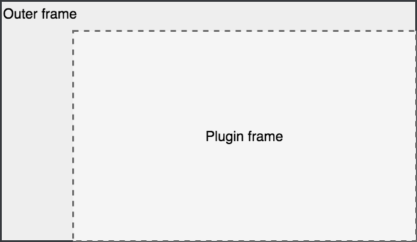

With modular applications built from multiple plugins and from multiple authors, it can be hard to balance user experience with development concerns. We want a framework which is ease to develop against, offering the user a range of functionality, but which is intuitive to the user.

As discussed in more details in the System design section, the application the user sees on the screen is an **outer frame** (or outer application) which wraps a **plugin frame** (or plugin).

## Our design approach

A user has data they wish to view and edit, and a set of tasks they need to execute. The role of the plugin developer is to create the functionality which the user needs.

In our experience, it is easier to develop smaller focused UIs which address specific tasks or visualisations needed by the analyst. By loosely linking these different task pages together the user can navigate between functions in a free form manner.

Translated to Invest plugins, which present a screen of information, become our pages. Each plugin offers a small set of tasks (displaying information, allowing editing, etc).

Plugins can query for other plugins which provide actions, and navigate to them (and pass data to them).

## The role of the plugin frame

The plugin is where UI application functionality is actually offered to the user. This could be anything from a map, form, table or complex dashboard. 

We opt to give the plugin developer complete freedom of their layout and UI. This is for two reasons:

* Plugin developers understand the use case they are addressing and should be able to design a UI which address this
* Plugin developers will be familiar with specific UI framework, and we don't want to force them into a particular library.

That said, the majority of our support is against React and Typescript, therefore developers may which to use those to ease the integration.

UI Plugins offer **intents, action and payload**. This concept is taken from React, Android, etc. Here the UI Plugin declares a set of action's it supports. An action is simply a `string`, for example `document.search` (might be an action which suggest a plugin has search for documents).

Actions are freeform and to be defined by the plugins and applications themselves. One application dealing with sales information might have `customer.edit`, `customer.list`, etc whilst another slideshow generator would offer plugins for `slide.edit`, and `slideshow.present`

Actions have a payload, which is a Javascript object, which acts as the parameters for an action. This has no fixed structure. In the `customer.edit` example the plugin might accept a `id` field which is the customer id. If this is not provided then the plugin would either default to a 'new customer mode' (create rather than edit) or might just display a message saying 'you must select a customer'.

As the `customer.edit` example shows, UI Plugins all fit into two general categories:

* Those can function without without an action or payload
* Those that require parameters (eg customer id) before they can function.

In general we suggest that your plugin does something useful whether called with an action or not, and if it is not supplied with the appropriate payload it still does as much as it can. However this is not always possible, or at least not possible without duplicating code (eg displaying a list of customers in order to allow edit). As we wish plugins to be focus in nature the right approach is to display a message to the user saying, and provide them options to other plugins which could help. In the `customer.edit` example this would be to redirect to the `customer.list` plugin.

An *intent* is the combination of an action and an optional payload.

In order to flow between plugins, each plugin can query for plugins which provide actions. For example, the List of Customers plugin (offering `customer.list` action itself) would offer a simple table of customer information (name, address, telephone). In order for the user to be allowed to viewed and edited it might query for plugins which offer the `customer.view` and `customer.edit` actions. It can then offer a button for the user to click and pass the customer id to those plugins.

Note that their may be none, one or many plugins which offer the `customer.edit` action, and the `customer.list` should react appropriately. For example:

* Not displaying or disabling a button if no action is available for it
* Displaying a default button or default text like 'View' or 'Go' if only one exists
* In the case of multiple options, either displaying some select for multiple actions (eg a drop down button), or selecting the 'best plugin'.

The API by which the plugin interacts with the outer frame is discussed in [Plugin API](ui.system-plugin.html). The outer frame is responsible for the delivery of correct and up to date information to the plugins. For example, When a plugin is declared, it has a set of user roles which are able able to access it. The outer frame provides only plugins which the current user is able to access.

## The role of the outer frame in the UI

The outer frame is unaware of the function of the application or the details of any of the specific plugins. It exists to:

* Download any data and settings needed by the application as a whole
* Provide functions which applied to the entire app, such as user sign in
* Display plugins for the user, and allow the user to switch between plugins
* Manage the URL and map the URL state to application state (eg to plugins)
* Provide an interface between plugins, and between plugins and the server.

From a user experience perspective the important roles of the are the URL handling (to enable users to bookmark and refresh the page) and the overall application layout. The remaining aspects are framework engineering functions.

### The 'outer application' implementation

The outer application, `invest-app`, is an instantiation of the Invest system. There is not reason that a developer or organisation couldn't replace it's UI to offer a different experience. For example, replacing Semantic UI to Material UI, changing the colour theme, or removing the side menu in preference for a top bar navigation.

It may be that a particular use case of Invest is sufficiently specialised that additional plugins are not envisaged. Thus the system can be used to develop a plugin system that is more tightly integrated and specialised than the generic Invest application.

